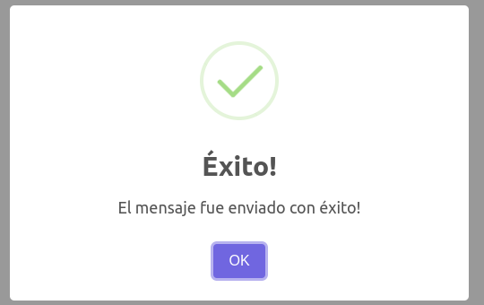
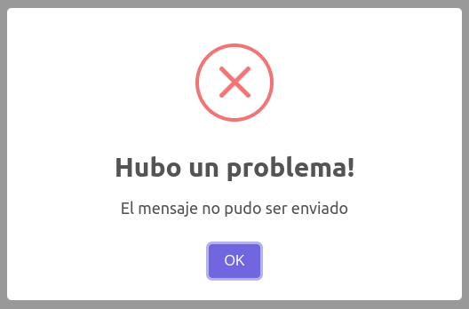
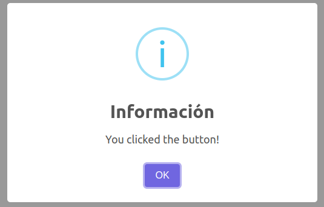

# Ong Client

## Available Scripts

In the project directory, you can run:

### `yarn start`

Runs the app in the development mode.<br />
Open [http://localhost:3000](http://localhost:3000) to view it in the browser.

The page will reload if you make edits.<br />
You will also see any lint errors in the console.

### `yarn test`

Launches the test runner in the interactive watch mode.<br />
See the section about [running tests](https://facebook.github.io/create-react-app/docs/running-tests) for more information.

### `yarn build`

Builds the app for production to the `build` folder.<br />
It correctly bundles React in production mode and optimizes the build for the best performance.

The build is minified and the filenames include the hashes.<br />
Your app is ready to be deployed!

See the section about [deployment](https://facebook.github.io/create-react-app/docs/deployment) for more information.

### Componente Skeleton

Para usar el componente Skeleton personalizado seguir estos pasos.

Importar el componente Skeleton, está ubicado en carpeta /features/skeleton/Skeleton.

    import Skeleton from './features/skeleton/Skeleton'

El componente recibe el parametro 'mode' para responder varios tipos de estructuras.
Adicional en el caso de usar el modo 'groupCards', se puede enviar por props la cantidad de tarjetas que se quiere renderizar, en el parametro 'quantity'. Ej:

    <Skeleton mode='groupCards' quantity='5'>
    ó
    <Skeleton mode='groupCards' quantity={5}>

Listado de modos del componente:

    -singleCard : Renderiza una sola tarjeta en carga
    -groupCards : Renderiza un grupo de tarjetas en carga
    -list : Renderiza una lista o tabla en carga
    -form: Renderiza un formulario en carga

El objetivo es renderizar este componente según la necesidad mientras hay una espera o carga por una respuesta de peticiones.

### `SweetAlert2`

[SweetAlert2](https://sweetalert2.github.io/) es una librería responsive, customizable y accesible que reemplazará las alertas de javascript.

Para implementar estas alertas debemos utilizar los servicios que están en `sweetAlertServices.js`

Por ejemplo:

```javascript
export const postContact = (data) => {
  axios
    .post(API_URL, data)
    .then(() => {
      sweetAlertSuccess("El mensaje fue enviado con éxito!");
    })
    .catch((err) => {
      sweetAlertError("El mensaje no pudo ser enviado");
    });
};
```

Asi se ven los tres tipos de alertas:

- `Para caso de éxito`

  

- `Para caso de error`

  

- `Para caso de información`

  

### Componente Progress

Muestra una barra que da un feedback al usuario mientras se esté cargando un recurso.

El componente ya viene con valores por defecto y se puede utilizar solo.

```
<Progress />
```

Si se de sea personalizar se puede hacer mediante props. Se puede modificar el color principal con primaryColor, el color de fondo con backgroundColor, la altura de la barra con height y redondear los bordes con borderRadius

Ejemplo de uso:

```
<Progress primaryColor= "#dc2626" backgroundColor= "#808080" height={10} borderRadius={5} />
```

primaryColor y backgroundColor reciben valores hexadecimales y rgb en formato string.

height y borderRadius reciben valores numericos que se representan en px. height={10} borderRadius={5} representa 10px y 5px respectivamente.

### Componente Spinner

Muestra una animación cuando se cargan los componentes, para darle feedback al usuario.

El componente ya viene con valores por defecto y se puede utilizar solo.


```
<Spinner />
```

Si se desea personalizar se puede hacer mediante props. Se puede modificar el color principal con color, la altura con height y el ancho con width.

Ejemplo de uso:

```
<Spinner color= "#faf" height={10} width={5} />
```

color recibe un valor hexadecimal.

height y width reciben valores numericos que se representan en px.
